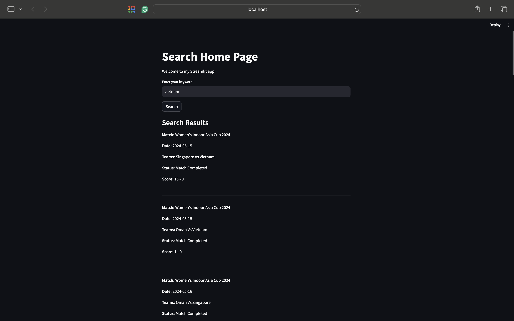

# WebScrapingProject

The provided code consists of two AWS Lambda functions: lambda_handler and gensim_query. These functions are designed to handle web scraping and querying the scraped data using machine learning techniques for similarity search.

**Web Scraping and Storag**e: lambda_handler function scrapes match data from a specified URL and stores it in an S3 bucket.

**Query and Similarity Search**: gensim_query function retrieves the stored data, processes it using Gensim, and performs a similarity search based on a user-provided query, returning the most relevant match information.

I've developed a local webpage using Streamlit, and the image below displays the search results. 

